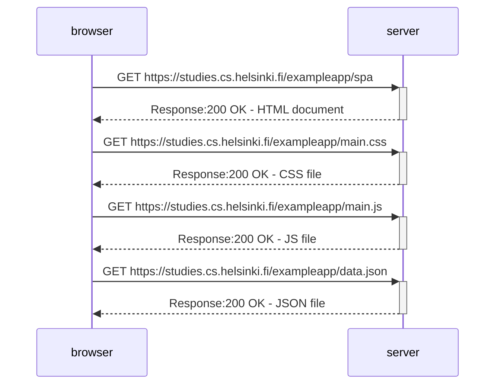

```mermaid
sequenceDiagram
    participant B as browser
    participant S as server

    B->>+S: GET https://studies.cs.helsinki.fi/exampleapp/spa
    S-->>-B: Response:200 OK - HTML document

    B->>+S: GET https://studies.cs.helsinki.fi/exampleapp/main.css
    S-->>-B: Response:200 OK - CSS file

    B->>+S: GET https://studies.cs.helsinki.fi/exampleapp/main.js
    S-->>-B: Response:200 OK - JS file

    B->>+S: GET https://studies.cs.helsinki.fi/exampleapp/data.json
    S-->>-B: Response:200 OK - JSON file
```