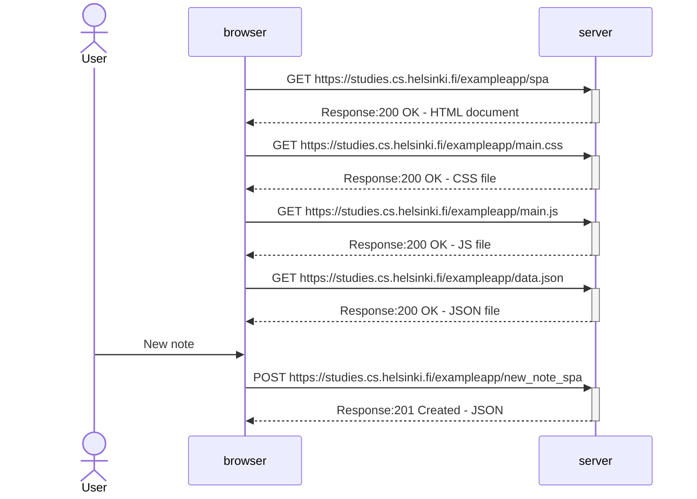

```mermaid
sequenceDiagram
    actor User
    participant B as browser
    participant S as server

    B->>+S: GET https://studies.cs.helsinki.fi/exampleapp/spa
    S-->>-B: Response:200 OK - HTML document

    B->>+S: GET https://studies.cs.helsinki.fi/exampleapp/main.css
    S-->>-B: Response:200 OK - CSS file

    B->>+S: GET https://studies.cs.helsinki.fi/exampleapp/main.js
    S-->>-B: Response:200 OK - JS file

    B->>+S: GET https://studies.cs.helsinki.fi/exampleapp/data.json
    S-->>-B: Response:200 OK - JSON file

    %% User types out a new note and clicks save button
    User->>B: New note
    B->>+S: POST https://studies.cs.helsinki.fi/exampleapp/new_note_spa
    S-->>-B: Response:201 Created - JSON
```